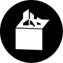

# items

> Render Minecraft blocks and items to images
> and provided pre-rendered images too.

items is a project that render Minecraft blocks and items to image through python and opengl without open the game. items provided pre-rendered images on github which is you can using it but not now (cuz this project didn't finished yet).

![()[]](https://media.discordapp.net/attachments/558622428754870272/1013591137757433856/cactus.png)
![()[]](https://media.discordapp.net/attachments/558622428754870272/1013592029592293447/observer.png)
![()[]](https://media.discordapp.net/attachments/558622428754870272/1013592272283119678/deepslate_diamond_ore.png)
![()[]](https://media.discordapp.net/attachments/558622428754870272/1013592803621744651/stonecutter.png)

## Checklist

Progressing list that this project was done.

- [ ] Blocks
  - [x] Block_items rendering
  - [x] Block_items white based rendering
  - [ ] Block_entities rendering
- [ ] Items
  - [x] resized minecraft:item/generated
  - [x] colorized white based items
  - [x] rendered template based items

## How to use

On Windows

```sh
pip install -r requirements.txt
```

```sh
python main.py --version {minecraft-version} --size {size-of-image}
```

On Linux ( Debian why? only `debian` cuz I'm lazy to test it on other platforms )

```sh
pip install -r requiremetns.txt
```

```sh
apt-get install freeglut3-dev libgl1-mesa-dev git xvfb xorg-dev cmake
mkdir /build
git clone https://github.com/glfw/glfw.git /build/glfw
cd /build/glfw
cmake -DBUILD_SHARED_LIBS=ON .
make
export PYGLFW_LIBRARY=/build/glfw/src/libglfw.so
```

```sh
xvfb-run -a python main.py --version {minecraft-version} --size {size-of-image}
```

## Contribute?

feel free to make a commit or pull request if you want to add or fix somethings.

## Disclaimer

Items IS NOT AN OFFICIAL MINECRAFT PRODUCT. NOT APPROVED BY OR ASSOCIATED WITH MOJANG STUDIOS.
